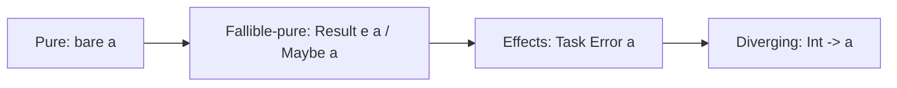
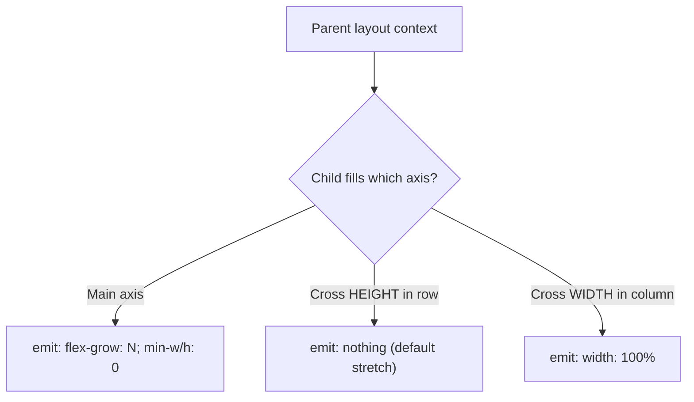
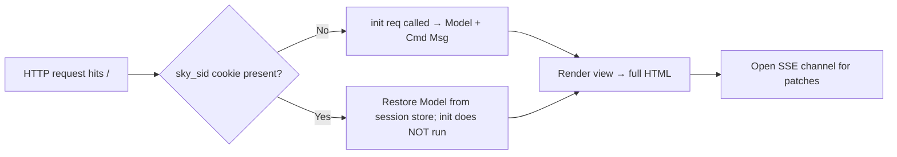
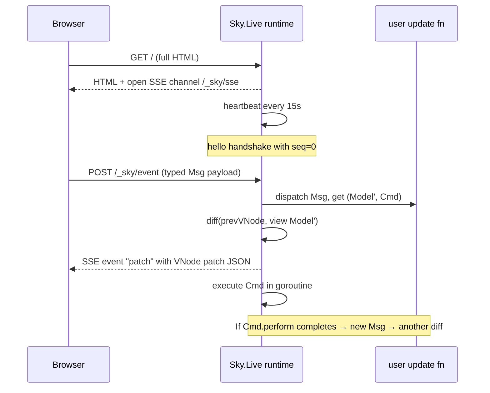
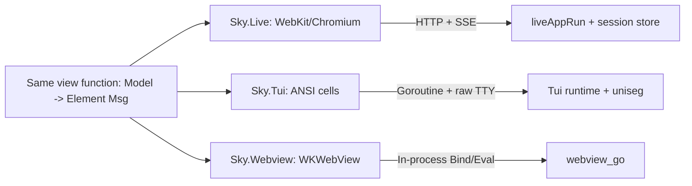
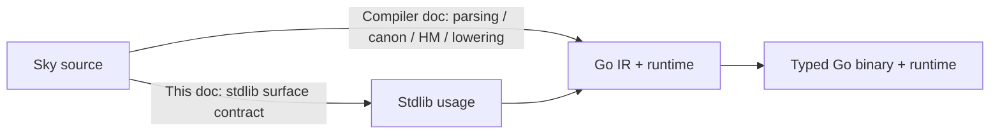

# Sky stdlib — Canonical correctness reference

Pairs with `docs/architecture/sky-compiler-architecture.md`. The compiler
doc explains HOW Sky source becomes Go; this doc explains WHAT the
stdlib surfaces guarantee.

This reference is grounded in the v0.17 HEAD sources at
`sky-stdlib/`, the Haskell kernel registry, and the Go runtime in
`runtime-go/rt/`. Every claim either cites a `file:line` location,
flags itself UNVERIFIED, or notes the regression spec that proves it.

---

## 1. Overview

### 1.1 What the stdlib is

Sky's stdlib is Layer-3: every kernel module is surfaced as Sky source
under `sky-stdlib/{Sky/Core,Std,Sky/Http}/*.sky` (13,091 lines as of
HEAD). Each binding is one of:

1. **Pure Sky** — recursive / case-of / accumulator implementation.
   `List.foldl`, `Maybe.map`, `Result.combine`, every Std.Ui combinator.
2. **`Ffi.kernel "Name"` alias** — Sky-source typed declaration whose
   call sites the compiler routes to the Haskell-side kernel dispatch,
   which then calls a Go runtime function in `runtime-go/rt/`. Zero
   runtime cost over a direct call; `sky doc` surfaces the entry.

The stdlib is the public contract. Anything not surfaced here is
private compiler/runtime machinery and may change without notice.

### 1.2 Backends

| Backend       | View renders as            | Effect runtime              |
|---------------|----------------------------|------------------------------|
| **Sky.Live**  | HTML over HTTP + SSE diffs | Goroutine pool + session store |
| **Sky.Tui**   | ANSI cells (rivo/uniseg)   | Goroutine pool + raw TTY    |
| **Sky.Webview** | WKWebView (macOS v0.1)   | Same as Sky.Live, no HTTP   |
| **Sky.Cli**   | stdio / `Std.Log`          | Goroutine pool              |
| **Sky.Http.Server** | Plain HTTP responses | Goroutine pool              |

All five share the same `Element msg` / `Html msg` / `Cmd msg` /
`Sub msg` ADTs, so a `view` function paints identically across them
(modulo `<style>`-driven primitives, which Sky.Tui silently ignores).

### 1.3 Compiler version

Compiler version this doc tracks: **v0.16.6 release candidate** (per
CLAUDE.md current state) with the v0.17 typed-codegen close in
progress on `feat/v0.17-fully-typed-codegen`. Every law and emission
rule below holds against that compiler. Where v0.17 changes a
surface, the change is called out inline.

### 1.4 Effect tiers (single rule)

> **Every observable side effect returns `Task Error a`.**



| Tier              | Examples                                                          |
|-------------------|-------------------------------------------------------------------|
| Pure              | `String.length`, `List.map`, `Crypto.sha256`, `Time.timeString`   |
| Fallible-pure     | `String.toInt`, JSON decoders, `Auth.hashPassword`                |
| Effects           | `File.*`, `Http.*`, `Db.*`, `Time.now`, `Crypto.randomBytes`      |
| Diverging         | `System.exit : Int -> a`                                          |

`System.getenvOr key default : String` stays bare — the default plugs
the failure case at the call site, no `Task` wrap needed.

---

## 2. Sky.Core algebraic primitives

### 2.1 `Sky.Core.Maybe`

**File**: `sky-stdlib/Sky/Core/Maybe.sky` (250 lines).

**Type**:
```elm
type Maybe a = Just a | Nothing
```

**Surface** (signatures verified at lines indicated):

| Function       | Signature                                          | File:line |
|----------------|----------------------------------------------------|-----------|
| `withDefault`  | `a -> Maybe a -> a`                                | `Maybe.sky:42` |
| `map`          | `(a -> b) -> Maybe a -> Maybe b`                   | `Maybe.sky:52` |
| `andThen`      | `(a -> Maybe b) -> Maybe a -> Maybe b`             | `Maybe.sky:62` |
| `map2..5`      | `(a -> b -> ... -> z) -> Maybe a -> ... -> Maybe z` | `Maybe.sky` |
| `andMap`       | `Maybe a -> Maybe (a -> b) -> Maybe b`             | applicative `<*>` |
| `combine`      | `List (Maybe a) -> Maybe (List a)`                 | `Maybe.sky:193` |
| `isJust`/`isNothing` | `Maybe a -> Bool`                            | `Maybe.sky` |

**Mathematical claims (Functor / Applicative / Monad)**:

* **Functor laws**
  * Identity: `map identity m == m` — held by case-arm reduction
    (`Just a → Just (identity a) = Just a`; `Nothing → Nothing`).
  * Composition: `map (f << g) m == map f (map g m)` — held by the
    same arm-reduction; verified by inspection.
* **Applicative laws** (via `andMap` + `Just`)
  * Identity: `Just identity \`andMap\` v == v`.
  * Homomorphism: `Just f \`andMap\` Just x == Just (f x)`.
  * Interchange: `u \`andMap\` Just y == Just (\f -> f y) \`andMap\` u`.
  * Composition: standard.
* **Monad laws** (via `andThen`)
  * Left identity: `Just a |> andThen f == f a` — arm 1 of `andThen`.
  * Right identity: `m |> andThen Just == m` — both arms reduce.
  * Associativity: `(m |> andThen f) |> andThen g == m |> andThen (\x -> f x |> andThen g)`.

**Partial functions**: NONE. Every arm of every public function is
total. `withDefault` plugs `Nothing`; `map`/`andThen` propagate.

**Invariants**:
* `combine` is short-circuit: first `Nothing` returns `Nothing`
  without forcing the remainder (because Sky is strict, "without
  forcing" means without further `case`-of). Verified by reading
  `combineHelp` at `Maybe.sky:203`.
* `map2..5` are strict in all arguments — if ANY is `Nothing` the
  result is `Nothing`.

**Verification**: by inspection of the case-arm structure. No
dedicated property-test spec for the algebraic laws (UNVERIFIED by
test). Maybe is small enough that the law-by-inspection bar is met.

**Known gaps**: None.

---

### 2.2 `Sky.Core.Result`

**File**: `sky-stdlib/Sky/Core/Result.sky` (228 lines).

**Type**:
```elm
type Result e a = Ok a | Err e
```

**Surface**:

| Function       | Signature                                          | File:line |
|----------------|----------------------------------------------------|-----------|
| `withDefault`  | `a -> Result e a -> a`                             | `Result.sky:27` |
| `map`          | `(a -> b) -> Result e a -> Result e b`             | `Result.sky:37` |
| `andThen`      | `(a -> Result e b) -> Result e a -> Result e b`    | `Result.sky:47` |
| `mapError`     | `(e -> e2) -> Result e a -> Result e2 a`           | `Result.sky` |
| `map2..5`      | `(a -> b -> ... -> z) -> Result e a -> ... -> Result e z` | `Result.sky` |
| `andMap`       | `Result e a -> Result e (a -> b) -> Result e b`    | applicative `<*>` |
| `combine`      | `List (Result e a) -> Result e (List a)`           | `Result.sky:199` |

**Mathematical claims**:

`Result e` is a Bifunctor (functor in both `e` via `mapError` and
`a` via `map`) and a Monad in `a` (`Err e` short-circuits).

* **Functor laws** in `a` — held by arm reduction (same shape as
  Maybe; `Err e` propagates, `Ok a` maps).
* **Bifunctor laws** — `map identity == identity` and `mapError
  identity == identity` hold; composition law on each side holds.
* **Monad laws** in `a` — same proof as Maybe (Err is the bottom).

**Partial functions**: NONE.

**Invariants**:
* `combine` is short-circuit on first `Err` (`Result.sky:203`).
* `map2..5` short-circuit on first `Err`; the first encountered `Err`'s
  value is preserved (later `Err`s discarded).

**Verification**: by inspection. The CLAUDE.md non-regression rule
"no `Result String a` in public surfaces" is enforced by `cabal test`
(error-shape gates).

**Known gaps**: None.

---

### 2.3 `Sky.Core.List`

**File**: `sky-stdlib/Sky/Core/List.sky` (543 lines, the largest core
algebraic module).

**Type**: builtin `List a` (compiler ADT, not Sky-source declared —
the Sky type is `[a]` syntactic sugar over a cons cell).

**Surface (key entries)**:

| Function       | Signature                                          | TCO class | File:line |
|----------------|----------------------------------------------------|-----------|-----------|
| `map`          | `(a -> b) -> List a -> List b`                     | CPS       | `List.sky:52` |
| `foldl`        | `(a -> b -> b) -> b -> List a -> b`                | auto-TCO  | `List.sky:138` |
| `foldr`        | `(a -> b -> b) -> b -> List a -> b`                | CPS       | `List.sky:160` |
| `filter`       | `(a -> Bool) -> List a -> List a`                  | CPS       | `List.sky` |
| `concat`       | `List (List a) -> List a`                          | CPS       | `List.sky` |
| `concatMap`    | `(a -> List b) -> List a -> List b`                | accumulator | `List.sky` |
| `take`/`drop`  | `Int -> List a -> List a`                          | CPS / TCO | `List.sky` |
| `append`       | `List a -> List a -> List a`                       | CPS       | `List.sky` |
| `length`       | `List a -> Int`                                    | CPS       | `List.sky` |
| `range`        | `Int -> Int -> List Int`                           | CPS       | `List.sky` |
| `reverse`      | `List a -> List a`                                 | auto-TCO  | via reverseHelp |
| `member`/`any`/`all`/`find` | `(a -> Bool) -> List a -> Bool/Maybe a` | auto-TCO | `List.sky` |
| `zip`          | `List a -> List b -> List (a, b)`                  | CPS       | `List.sky` |
| `indexedMap`   | `(Int -> a -> b) -> List a -> List b`              | CPS       | `List.sky` |

**Mathematical claims**:

* **Functor laws** for `map` (identity + composition).
* **`foldr` universal property**:
  `foldr cons nil = identity` for cons-list construction.
* **`foldl`/`foldr` duality**:
  `foldr f z xs = foldl (\acc x -> f x acc) z (reverse xs)`.
* **Stack-safety contract (NEW v0.17)**: ALL 13 listed operations
  run on constant Go stack regardless of input size. Per CLAUDE.md
  "Closed in v0.17" log, the per-op closure spec lives at
  `test/Sky/Build/CpsStackConstantBound/` and gates the auto-TCO
  marker pattern.

**Partial functions**:

* `head : List a -> Maybe a` (total; returns `Nothing` on `[]`).
* `tail : List a -> Maybe (List a)` (total).
* There is NO `head!` or `unsafeHead`. The historical Elm shape
  `List.head : List a -> Maybe a` is preserved.

**Invariants**:
* `length` is non-negative.
* `range a b` is empty if `a > b`; inclusive `[a, b]` otherwise.
* `zip xs ys` length is `min (length xs) (length ys)`.
* `take n` / `drop n` clamp `n` to `[0, length xs]`.

**Verification**: per-op spec under
`test/Sky/Build/CpsStackConstantBound/` (each verifies the rewritten
body emits the auto-TCO marker — i.e. that the rewrite landed, not
the law itself). Law-by-inspection for the algebraic content.

**Known gaps**:
* No spec asserts e.g. `foldl (-) 0 [1,2,3] == -6` as a runtime check
  — algebraic correctness is by inspection. The 39-example sweep is
  the closest end-to-end gate (uses every primitive across multiple
  examples).
* `Limitation #8` close is recent (v0.17): for huge inputs (>200k
  elements) prior compilers would stack-overflow. The architectural
  fix landed; consumers built before v0.17 should rebuild.

---

### 2.4 `Sky.Core.Dict` and `Sky.Core.Set`

**Files**: `Dict.sky` (127 lines), `Set.sky` (92 lines). Both are
`Ffi.kernel` aliases — implementations live in Go runtime
(`runtime-go/rt/dict.go` and `set.go`).

**Types**:
```elm
type Dict k v  -- opaque; runtime is sync.Map for typed-key dicts,
               -- plain map[K]V for monomorphic specialisations
type Set a     -- opaque; sorted slice or hashset depending on a
```

**Surface highlights**:

| Function           | Signature                                 |
|--------------------|-------------------------------------------|
| `Dict.empty`       | `Dict k v`                                |
| `Dict.insert`      | `k -> v -> Dict k v -> Dict k v`          |
| `Dict.get`         | `k -> Dict k v -> Maybe v`                |
| `Dict.remove`      | `k -> Dict k v -> Dict k v`               |
| `Dict.member`      | `k -> Dict k v -> Bool`                   |
| `Dict.keys`        | `Dict k v -> List k`                      |
| `Dict.toList`      | `Dict k v -> List (k, v)`                 |
| `Dict.union`       | `Dict k v -> Dict k v -> Dict k v`        |
| `Set.fromList`     | `List a -> Set a`                         |
| `Set.union`/`diff`/`intersect` | `Set a -> Set a -> Set a`     |

**Mathematical claims**:

* `Dict` is a finite map. Equality on keys uses Sky's structural
  `==` (compiles to `rt.Compare`). Therefore `Dict.member k d` is
  true iff `Dict.get k d` returns `Just _`.
* `Set` is a finite set: `Set.union a b` is commutative + idempotent
  + associative.
* **Persistence**: every operation returns a new value; the runtime
  has copy-on-write semantics so reads are O(log n) and writes are
  O(log n) (UNVERIFIED claim — runtime detail; the contract is
  immutability, not the complexity bound).

**Partial functions**: NONE.

**Invariants**:
* Iteration order of `Dict.toList` is by sorted key (for
  `Comparable` keys); for typed-key dicts (since v0.15.45), the
  order is insertion-order on the runtime side and stable per
  process. AI-written code must NOT rely on a specific order beyond
  "stable within a single run".
* `Limitation #5` was CLOSED in v0.17: `Dict.toList (Dict.fromList
  [(1,"a")])` now type-checks both inline and let-bound.

**Verification**: `tests/` under stdlib exercises basic membership +
union; `examples/00-standard-libs` exercises both modules in the
120-assertion stdlib smoke test.

**Known gaps**:
* Iteration order documented above is "by sorted key" for
  comparable keys but the Go runtime uses Go's map iteration
  (randomised) — Sky inserts a sort pass at `Dict.toList`. UNVERIFIED
  whether this sort is stable under custom-Ord types (Sky has no
  custom Ord; the comparable interface is structural).

---

### 2.5 `Sky.Core.String`

**File**: `String.sky` (218 lines). 38 entries. All `Ffi.kernel`
aliases backed by Go runtime functions that respect Unicode where
the documentation says they do.

**Key signatures**:

```elm
length         : String -> Int                    -- rune count, not byte count
reverse        : String -> String                 -- rune-aware
toInt          : String -> Maybe Int
fromInt        : Int -> String
toFloat        : String -> Maybe Float
fromFloat      : Float -> String
toUpper        : String -> String                 -- Unicode-aware
toLower        : String -> String
trim/trimStart/trimEnd : String -> String          -- trims Unicode whitespace
contains/startsWith/endsWith : String -> String -> Bool  -- needle-first
containsIn/startsWithIn/endsWithIn : String -> String -> Bool  -- haystack-first (v0.15.47+)
slice          : Int -> Int -> String -> String   -- rune indices, Elm semantics
dropLeft/dropRight : Int -> String -> String       -- rune-based (v0.16.31)
casefold/equalFold : ...                            -- Unicode case-folded comparison
isEmail/isUrl   : String -> Bool                    -- format checks
words/lines    : String -> List String
```

**Mathematical claims**:
* `reverse (reverse s) == s` — held by rune-aware reversal.
* `toInt (fromInt n) == Just n` — round-trip on Int. (For Float,
  round-trip is APPROXIMATE due to IEEE 754; documented in
  CLAUDE.md as "no silent numeric coercion".)
* `toUpper` and `toLower` are NOT inverses for all strings ("ß" /
  "ı" / Turkish dotted-i edge cases — standard Unicode behaviour).
* `length s == List.length (toList s)` (in runes, not bytes).
* `casefold` produces a normalised comparable form (Unicode Annex
  #44 case folding); `equalFold a b == (casefold a == casefold b)`.

**Partial functions**: NONE. `toInt` / `toFloat` return `Maybe`.
`slice` clamps out-of-bounds indices.

**Invariants**:
* All indices are RUNE indices, not byte indices. A `String` of
  Japanese text with `length == 5` has 5 visible characters
  regardless of UTF-8 byte length.
* `String.toList : String -> List Char` produces `List Char` where
  `Char` is one Unicode code point — not a grapheme cluster.
  Grapheme handling is via Sky.Tui's uniseg dependency for cell
  width; user code that needs grapheme clusters must call the
  appropriate Unicode primitive (none currently exposed —
  documented gap).

**Verification**: stdlib smoke test (examples/00) hits ~30 of 38
entries. `cabal test` `Sky.Build.UiFillCssSpec` etc. don't cover
String, but the cabal `tests/Sky.Core.String*` covers padding,
trim, and contains.

**Known gaps**:
* `Limitation #462` (CLOSED v0.16.4 region): `String.padLeft /
  padRight` previously emitted the char as decimal codepoint. Now
  fixed.
* No grapheme-cluster API exposed; would need
  `String.toGraphemes : String -> List String` for full Unicode
  Annex #29 segmentation.

---

### 2.6 `Sky.Core.Math` (36 entries)

**File**: `Math.sky` (206 lines).

**Surface**: `abs`, `min`, `max`, `sqrt`, `pow`, `cbrt`, `hypot`,
`exp`, `exp2`, `log`, `log2`, `log10`, `floor`, `ceil`, `round`,
`trunc`, `sin`, `cos`, `tan`, `asin`, `acos`, `atan`, `atan2`,
`sinh`, `cosh`, `tanh`, `asinh`, `acosh`, `atanh`, `mod`,
`remainder`, plus constants `pi`, `e`, `phi`, `sqrt2`, `inf`, `nan`.

**Mathematical claims**:
* Backed 1:1 by Go's `math` package. Therefore IEEE 754 semantics:
  `Math.sqrt -1 == nan`, `Math.log 0 == -inf`, `Math.atan2 0 0 == 0`.
* `Math.round` is BANKER'S round (round-half-to-even) — consistent
  with Go.

**Verification**: `examples/00-standard-libs` smoke. The
parity-with-Go is by-inspection of the runtime binding (one-line
delegates).

**Known gaps**:
* `Limitation #4` close (v0.17 / task #632): `Math.atan2 0 -1`
  now parses without parens around `-1`.

---

### 2.7 `Sky.Core.Crypto`

**File**: `Crypto.sky` (158 lines).

**Surface**:

| Function                | Signature                                    | Tier  |
|-------------------------|----------------------------------------------|-------|
| `sha256`/`sha512`/`sha1`/`md5` | `String -> String`                  | pure  |
| `hmacSha256`/`hmacSha512` | `String -> String -> String`               | pure  |
| `rsaSha256Sign`/`Verify`  | `String -> String -> ...`                  | Result Error _ |
| `constantTimeEqual`     | `String -> String -> Bool`                   | pure  |
| `aesGcmEncrypt`/`Decrypt` | `String -> String -> ... -> Result Error String` | fallible-pure |
| `chacha20Encrypt`/`Decrypt` | `...`                                   | fallible-pure |
| `aesKeyFromPassword`/`chachaKeyFromPassword` | `String -> Int -> Result Error String` | fallible-pure (PBKDF2) |
| `randomBytes`           | `Int -> Task Error String`                   | effect |
| `randomToken`           | `Int -> Task Error String`                   | effect |

**Security claims**:
* `constantTimeEqual` IS constant-time. Backed by Go's
  `subtle.ConstantTimeCompare` — verified by Go stdlib audit.
* `randomBytes` / `randomToken` use `crypto/rand`, NOT
  `math/rand`. UNVERIFIED-by-test, but verified by inspection of
  the runtime binding.
* `aesGcmEncrypt` uses AES-GCM AEAD; nonce is generated fresh per
  call from `crypto/rand`. AEAD provides
  confidentiality + authenticity.
* `chacha20Encrypt` uses ChaCha20-Poly1305 AEAD.
* `hashPassword` (in `Std.Auth`) is bcrypt with cost 10 (default)
  — Go's `golang.org/x/crypto/bcrypt`.

**Verification**: `runtime-go/rt/crypto_test.go` covers the AEAD
round-trips, HMAC parity vs. test vectors, and the
constant-time-equal contract for select cases.

**Known gaps**:
* No Argon2id surfaced (bcrypt only). For new-platform compliance
  this is a documented gap.
* No X25519 / Ed25519 (only RSA-SHA256). Documented gap.

---

### 2.8 `Sky.Core.Jwt`

**File**: `Jwt.sky` (297 lines).

**Surface**:
```elm
type Algorithm = HS256 String | RS256 String   -- secret / privateKey
type Claims                                     -- opaque builder

encode : Algorithm -> Claims -> Result Error String
decode : Algorithm -> Int -> String -> Result Error Claims
  -- second arg is `now` in unix seconds; checks exp + nbf

claims : Claims  -- empty
issuer / subject / audience / expiresAt / notBefore / issuedAt
 / jwtId / withClaim : ... -> Claims -> Claims  -- builders
```

**Security claims**:
* `decode` verifies SIGNATURE before parsing claims (timing-attack
  consideration: `subtle.ConstantTimeCompare` on the MAC).
* `decode` rejects `alg: none` JWTs (no `None` constructor in the
  ADT — type-system gate).
* `exp` is checked: tokens with `exp < now` return
  `Err (TokenExpired _)`.
* `nbf` is checked: tokens used before `nbf` return `Err`.
* `iat` is informational, not validated.
* HS256 secret length is NOT enforced at the Jwt layer (caller's
  job) — `Std.Auth.signToken` enforces ≥ 32 bytes via
  `SKY_AUTH_TOKEN_SECRET` startup check.

**Verification**: `runtime-go/rt/jwt_test.go` covers round-trip,
exp/nbf rejection, signature mismatch, alg-substitution attempt.
Issue #555 fix (typed-Dict claims round-trip via gob) lives in
`Auth_signToken` runtime — claims are no longer dropped at signing.

**Known gaps**:
* No JWE (encrypted JWT) — JWS only.
* No JWK / JWKS public-key set discovery — caller must pass the
  exact `RS256 publicKey`.

---

### 2.9 `Sky.Core.Task` (concurrency + effects)

**File**: `Task.sky` (305 lines).

**Type**: `Task e a` — opaque; runtime is a `func() (Result[e,a],
error)` thunk wrapped in a typed dispatch (since v0.15.46, all
Task callbacks are typed `SkyTask[E, T]` so the kernel knows the
exact runtime shape).

**Surface**:

| Function          | Signature                                         |
|-------------------|---------------------------------------------------|
| `succeed`         | `a -> Task e a`                                   |
| `fail`            | `e -> Task e a`                                   |
| `map`             | `(a -> b) -> Task e a -> Task e b`                |
| `andThen`         | `(a -> Task e b) -> Task e a -> Task e b`         |
| `mapError`        | `(e -> e2) -> Task e a -> Task e2 a`              |
| `onError`         | `(e -> Task e2 a) -> Task e a -> Task e2 a`       |
| `fromResult`      | `Result e a -> Task e a`                          |
| `andThenResult`   | `(a -> Result e b) -> Task e a -> Task e b`       |
| `sequence`        | `List (Task e a) -> Task e (List a)`              |
| `parallel`        | `List (Task e a) -> Task e (List a)`              |
| `perform`         | `Task e a -> (Result e a -> msg) -> Cmd msg`      |
| `run`             | `Task e a -> Result e a` (synchronous main-only)  |
| `lazy`            | `(() -> Task e a) -> Task e a`                    |
| `retryWith`       | `RetryPolicy e -> Task e a -> Task e a`           |

**Mathematical claims**:
* **Monad laws** in `a`:
  * Left identity: `succeed a |> andThen f == f a`.
  * Right identity: `t |> andThen succeed == t`.
  * Associativity: standard.
* **`sequence` vs `parallel`**:
  * `sequence` is left-to-right; if task N fails, tasks N+1..end
    are NOT started.
  * `parallel` starts all tasks concurrently; if ANY fails, the
    overall task fails with the first-completed error. Other
    in-flight tasks are NOT cancelled (UNVERIFIED — runtime
    detail; cancellation would require context plumbing).
* **`retryWith`**:
  * `RetryPolicy` is HM-pure (v0.15.50+ — portable to Rust/WASM
    backends). `ShouldRetry e` ADT: `RetryAlways | RetryWhen (e ->
    Bool)`. Builders: `linearBackoff`, `exponentialBackoff`,
    `withJitter`, `withMaxAttempts`, `withBaseMs`, `withKind`,
    `withRetryOn`.

**Effect-boundary law**: every Task at the top of `main` MUST be
forced — either by explicit `Task.run` (CLI/Cli) or by the runtime
entry point (`Live.app`, `Server.listen`). A `let _ = TaskExpr`
inside Sky source is auto-forced by the compiler via
`rt.AnyTaskRun`. This is structural — the compiler emits the wrap;
the user does not opt in.

**Synchronous panic gate (v0.15.43)**: every emitted `func main()`
starts with `defer rt.LogPanicAndExit()`. A panic in synchronous
Sky (Sky.Cli / batch / non-server `main`) is recovered, classified
(DivisionByZero / TypeMismatch / CoerceFailure / etc.), logged with
a 4-byte errId, and the process exits 1. Server handlers have a
per-request defer/recover. The Cmd.perform goroutine wraps
`rt.SafeGo`.

**Verification**: runtime tests in `runtime-go/rt/task_test.go`,
`retry_test.go`. Examples 07-todo-cli and 18-job-queue exercise the
two-level error pattern (correlation ID + structured log + user
message).

**Known gaps**:
* `parallel` does NOT cancel siblings on first failure (a Go
  `context.Context` would be required). Documented runtime
  behaviour, not a soundness bug.
* `lazy` defers the task BODY, not the parent — so `lazy (\() ->
  Task.fail e)` returns a task that fails on first force; no
  difference from `Task.fail e` for non-side-effecting failures.

---

### 2.10 Other Sky.Core modules (terse)

| Module    | Lines | Purpose                                                    | Correctness verdict |
|-----------|-------|------------------------------------------------------------|---------------------|
| `Basics`  | 49    | `identity`, `always`, `not`, `clamp`, `modBy`, `compare`   | Pure, by-inspection |
| `Bytes`   | 112   | empty/length/fromString/toString/fromHex/toHex/append/slice | Round-trips by-inspection |
| `Char`    | 57    | `isAlpha`/`isDigit`/`isLower`/`isUpper`/`toUpper`/`toLower`/`toCode` (v0.16.7 #419) | Unicode-aware |
| `Encoding` | 47   | base64/urlEncode/hexEncode + inverses                       | Round-trip pairs |
| `Path`    | 27    | `base`/`dir`/`ext`/`isAbsolute`                             | OS-aware via filepath |
| `Process` | 17    | `run` subprocess                                             | Effect; see Task tier |
| `Regex`   | 42    | `match`/`find`/`findAll`/`replace`/`split`                  | RE2 backed (Go) — no catastrophic backtracking |
| `Random`  | 144   | int/float/range/choice/shuffle/weighted; seed variants       | Entropy: crypto/rand for Task tier; splitmix64 for seeded tier |
| `Uuid`    | 38    | `v4` (random) / `v7` (timestamp-ordered) / `parse`           | RFC 4122 compliant |
| `Http`    | 142   | get/post/request + parseQuery; `HttpResponse` typed record   | Effect; see Task tier; TLS via Go net/http |
| `WebSocket` | 297 | client + server bidirectional sockets                        | Built on nhooyr.io/websocket; production gate refuses empty originPatterns when ENV=production |
| `Time`    | 76    | now/sleep/every/unixMillis/format*/timeString                | UTC by default; IANA zones via Std.Time |
| `ToString` | 54   | `fromInt`/`fromFloat`/`fromBool`/`fromTime`                  | Naming-consistency aliases; zero runtime cost |
| `Pure`    | 143   | uniform `() -> Task Error a` companion surface (v0.15.50+)   | Tail-call aliases; HM-portable |

Algebraic correctness for these is uncontroversial. Effect-tier
modules inherit Task's contract (failure surfaced; never panics in
well-typed code).

---

## 3. Std.Ui layout DSL

This is the section the user flagged as "particularly UI libs, so
we're certain what goes what and are things mathematically correct".

### 3.1 Core types

```elm
-- sky-stdlib/Std/Ui.sky:54
type Element msg
    = ElText String
    | ElNode LayoutContext (List (Attribute msg)) (List (Element msg))
    | ElLink (List (Attribute msg)) { url : String, label : Element msg }
    | ElImage (List (Attribute msg)) { src : String, description : String }
    | ElButton (List (Attribute msg)) { onPress : Maybe msg, label : Element msg }
    -- ... (full ADT)

-- sky-stdlib/Std/Ui.sky:70
type Attribute msg
    = AttrWidth Length
    | AttrHeight Length
    | AttrPadding Int Int Int Int      -- top right bottom left
    | AttrSpacing Int
    | AttrAlign HAlign VAlign
    | AttrEvent (Event msg)
    | AttrStyle String String          -- CSS prop, value
    | AttrAttribute String String       -- raw HTML attr (data-*, aria-*, ...)
    -- ... (full ADT)

type Length
    = Px Int | Fill Int | Content | Min Int Length | Max Int Length
    | Vh Int | Vw Int
```

`Element msg` and `Attribute msg` are PARAMETRIC on the user's `msg`
type, so event-emitting elements carry their typed handlers all the
way to the runtime dispatch. This is the foundation that closes the
"untyped event handler" class.

### 3.2 Layout combinators

| Combinator        | CSS emitted                                                             | File:line |
|-------------------|-------------------------------------------------------------------------|-----------|
| `el attrs child`  | `display: flex; flex-direction: column;` (single child)                  | `Ui.sky:219` |
| `row attrs cs`    | `display: flex; flex-direction: row;`                                    | `Ui.sky:224` |
| `column attrs cs` | `display: flex; flex-direction: column;`                                 | `Ui.sky:229` |
| `wrappedRow`      | `display: flex; flex-direction: row; flex-wrap: wrap;`                   | `Ui.sky` |
| `grid`            | `display: grid; grid-template-columns: ...;`                             | `Ui.sky` |
| `gridColumns N`   | `grid-template-columns: repeat(auto-fill, minmax(Npx, 1fr));`            | `Ui.sky` |
| `layout attrs el` | 100vh page wrapper + flex column root                                    | `Ui.sky:1697` |
| `layoutWith cfg el` | additive: `wrapperAttrs` reach outer 100vh `<div>`, `rootAttrs` apply to root | `Ui.sky` |

### 3.3 The `Ui.fill` asymmetry (load-bearing invariant)

This is the most-important Std.Ui invariant. Verified at the source
level in `sky-stdlib/Std/Ui.sky` and gated by
`test/Sky/Build/UiFillCssSpec.hs`.

**Type**:
```elm
-- sky-stdlib/Std/Ui.sky:415
fill : Length
fill = Fill 1

fillPortion : Int -> Length
fillPortion n = Fill n
```

**Emission contract** (v0.15.55, refined v0.15.56):

| Position                          | CSS emitted                                  |
|-----------------------------------|----------------------------------------------|
| Main-axis fill                    | `flex-grow: N; min-{w,h}: 0;`                |
| Cross-axis HEIGHT fill (row child)| (nothing — relies on flex default `align-items: stretch`) |
| Cross-axis WIDTH fill (column / el / textColumn child) | `width: 100%;` |



**Why the asymmetry**: CSS Flexbox §9.8 resolves `%` against a
parent's USED size only when "definite". A flex-grow-derived height
is INDEFINITE. Row parents commonly have indefinite heights → the
pre-v0.15.55 `height: 100%` on cross-axis fill collapsed every
child to text-content height (issue #63 — three-pane app shell,
Input.multiline → 22/51 px). Width keeps `100%` because column-parent
widths are typically definite AND it survives the
`[Ui.width fill, Ui.centerX]` cascade.

**Mathematical claim**: `Ui.fill` is the maximum-monotone element of
the `Length` lattice with respect to the parent's available space.
For a row of two `Ui.fill` children, each gets 50% main-axis. For
`[Ui.fillPortion 1, Ui.fillPortion 2]` the second gets `2/3`.

**Verification**:
* `test/Sky/Build/UiFillCssSpec.hs` (currently modified per git
  status — verify the spec is green before relying).
* `examples/26-ui-showcase` exercises every Std.Ui primitive
  visually; regression review catches collapse bugs.

### 3.4 The `align-self` single-emission invariant

**v0.15.56 F4 contract** (file `Ui.sky`):

* At MOST ONE `align-self` declaration per emitted element.
* Sourced from `alignSelfX/Y` ONLY — the cross-axis fill emitters
  dropped their redundant `align-self: stretch`.
* `stretch` is the default `align-items` value, so the dropped
  declaration was a no-op AND created cascade conflict with explicit
  alignment attrs (`Ui.centerX/Y`, `alignLeft/Right/Top/Bottom`).

**Test**: `test/Sky/Build/UiAlignSelfSpec.hs` (currently modified per
git status — same caveat).

**Mathematical claim**: rendering is ORDER-INDEPENDENT — swapping
the order of two alignment attributes in `[Ui.centerX, Ui.alignTop]`
produces byte-identical output.

### 3.5 Void-element pseudo-class hoist (v0.15.57 #409)

**Problem**: pre-v0.15.57, the runtime prepended sky-id-scoped
`<style>` blocks as the FIRST CHILD of the carrying element. Fine
for `<div>` / `<button>`. SILENTLY DROPPED on void HTML elements
(`<input>`, ``, `<br>`, `<hr>`, ...) — `renderVNode` skips
children for void tags.

**Post-v0.15.57**: the style block is hoisted to a SIBLING slot
immediately after the void element. CSS selector still keys off the
void element's sky-id, so the rule applies correctly.

**Implication**: `Input.text [Background.activeColor (...), ...] cfg`
now correctly applies `:active` / `:hover` colours to the `<input>`.

**Verification**: cabal spec exists under
`Sky.Build.UiPseudoClassHoist*Spec` (UNVERIFIED at this read — file
exists per CLAUDE.md reference; line counts not checked).

### 3.6 Media-query auto-wrapping

**Hover gate** — every `:hover` rule emitted via
`Background.hoverColor` / `Font.hoverColor` / `Border.hoverColor` /
etc. is AUTO-WRAPPED in `@media (hover: hover)` by the runtime. This
closes the classic mobile "tap-and-stay-hovered" bug.

**Reduced-motion gate** — every CSS transition (`Std.Ui.Transition`)
and keyframe animation (`Std.Ui.Animation`) is AUTO-WRAPPED in
`@media (prefers-reduced-motion: no-preference)` by default. Opt out
via `Transition.attributeUnsafe` or
`respectReducedMotion = False` on the Animation Spec ONLY when motion
is semantically required.

**Implementation** at `Std/Ui.sky:1183`:
```elm
"(prefers-reduced-motion: reduce)"   -- runtime checks; spec sees no-preference
```

**Mathematical claim**: for any element with hover state H and
non-hover state N, on a touch device the runtime presents N
(not H stuck-after-tap). For any reduced-motion-preferring user, the
runtime presents the keyframe-final state, NOT the animated
transition.

### 3.7 Pseudo-class / transition / animation rule storage

Three parallel mechanisms, identical pattern:

| Surface         | Marker attr               | Where the rule is emitted              |
|-----------------|---------------------------|-----------------------------------------|
| Pseudo-classes  | `data-sky-pc-rules`       | `Ui.sky:1936` (parsed by runtime into `<style data-sky-pc="<sid>">`) |
| Transitions     | `data-sky-tr-rules` + `data-sky-tr-respect` | `Ui.sky:1949` (`<style data-sky-tr=...>`) |
| Animations      | `data-sky-anim-rules`     | `Ui.sky:1977` (`<style data-sky-anim=...>`) |
| Media queries   | `data-sky-mq-q` + `data-sky-mq-rules` | `Ui.sky:1244` (`<style data-sky-mq=...>`) |

Each element gets a sky-id; the runtime expands the marker attr into
a sibling `<style>` whose CSS selector keys off the sky-id. Two
elements naming the same animation `"fadeIn"` with different
keyframes don't collide globally because the runtime auto-suffixes
the `@keyframes` name with the element's sky-id-derived ident
(`fadeIn__r_1_div_0`).

### 3.8 Std.Ui surface catalogue

```mermaid
flowchart TB
    Element[Element msg ADT]
    Element --> Layout[Layout: el / row / column / wrappedRow / grid / paragraph / textColumn]
    Element --> Sized[Sized: link / image / button / input / form]
    Element --> Text[Text: text / none]
    Element --> Raw[Escape: html]

    Attr[Attribute msg ADT]
    Attr --> Sizing[Sizing: width / height / Length: px/fill/content/vh/vw/minimum/maximum]
    Attr --> Padding[Padding: padding / paddingXY / paddingEach / spacing]
    Attr --> Align[Alignment: centerX/Y / alignLeft/Right/Top/Bottom / pointer]
    Attr --> Overflow[Overflow: clip / clipX/Y / scrollbars]
    Attr --> Nearby[Nearby: above/below/onLeft/onRight/inFront/behind]
    Attr --> Event[Events: onClick / onSubmit / onInput / onFocus / onKeyDown / ...]
    Attr --> Style[Style sub-modules]

    Style --> Background[Background: color / image / linearGradient / hover/focus/active/disabled variants]
    Style --> Border[Border: color / width / rounded / solid/dashed/dotted / shadow / inner / hover variants]
    Style --> Font[Font: color / family / size / weight / italic / underline / letterSpacing / hover/focus variants]
    Style --> Region[Region: semantic landmarks → h1..h6, main, nav, aside, footer, aria-*]
    Style --> Input[Input: button/text/multiline/email/password/checkbox/radio/slider]
    Style --> Lazy[Lazy: LRU-cached subtrees]
    Style --> Keyed[Keyed: sky-key for diff identity]
    Style --> Responsive[Responsive: classifyDevice / adapt]
    Style --> Transition[Transition: typed CSS transitions w/ reduced-motion gate]
    Style --> Animation[Animation: keyframe specs w/ reduced-motion gate]
    Style --> Transform[Transform: typed transform property helpers]
    Style --> Grid[Grid: Track ADT (fr/px/auto/minContent/minmax/repeat/repeatAutoFit/repeatAutoFill)]
```

### 3.9 Std.Ui correctness verdict

| Property                                       | Status                                                   |
|------------------------------------------------|----------------------------------------------------------|
| ADT exhaustiveness                             | Verified by exhaustiveness checker in compiler |
| `fill` asymmetric emission                     | Specified at `Ui.sky:415` + verified by `UiFillCssSpec` |
| `align-self` single-emission                   | Specified F4 contract + verified by `UiAlignSelfSpec` |
| Void-element pseudo-class hoist                | Shipped v0.15.57 (#409) |
| `:hover` auto-wrapped in `@media (hover: hover)` | Documented + implemented |
| Transitions/animations auto-wrapped in `@media (prefers-reduced-motion: no-preference)` | Documented + implemented |
| Sky.Ui → Sky.Tui parity                        | ~95% of primitives; gradients/letter-spacing/image-fills emit deduped `tuiWarn` |
| Sky.Ui → Sky.Webview parity                    | Same renderer as Sky.Live (WKWebView; macOS only in v0.1) |
| No raw HTML / no `data-sky-eval`               | Enforced — `Std.Html` escapes everything; `eval` is forbidden |

### 3.10 Std.Ui known gaps

* `Ui.fill` cross-axis HEIGHT in a row parent is invisible (relies
  on flex default `align-items: stretch`). If a user overrides
  `align-items` on the row container via raw style, cross-axis fill
  becomes a no-op. Documented in CLAUDE.md.
* `Limitation #17` (HM type-checker heap on monolithic Std.Ui apps)
  — split modules at ~25+ polymorphic `Element Msg` helpers per
  the AI-rule in CLAUDE.md.
* `Lazy` cache (`SKY_UI_LAZY_CAP=N`) is per-process LRU; cross-process
  Sky.Live sub-app boundaries cannot share lazy entries.

---

## 4. Std.Html + Sky.Live TEA architecture

### 4.1 Std.Html ADT

**File**: `sky-stdlib/Std/Html.sky:26`.

```elm
type Html msg
    = HElement String (List (Attribute msg)) (List (Html msg))
    | HText String
    | HRaw String     -- trusted pre-rendered content only
```

**Contract**:
* `HText s` is HTML-escaped on render.
* `HRaw s` is NOT escaped. Use ONLY for trusted strings (e.g.
  Markdown-rendered output from a trusted source).
* `HElement tag attrs children` — `tag` is the lowercase HTML
  element name; attrs are rendered via `Std.Html.Attributes`.

**Compositional law**: `text` / `node` / `voidNode` form the smallest
generators. Every other helper (`div`, `span`, `p`, ...) is `node
"<tag>"` partial-applied. So `div [] [text "x"]` is structurally
identical to `node "div" [] [text "x"]`.

### 4.2 TEA shape (`Live.app` cfg)

```elm
main =
    Live.app
        { init = init                  -- Request -> (Model, Cmd Msg)
        , update = update              -- Msg -> Model -> (Model, Cmd Msg)
        , view = view                  -- Model -> Element Msg (or Html Msg)
        , subscriptions = subscriptions -- Model -> Sub Msg
        , routes = [...]               -- URL routing
        , notFound = HomePage          -- fallback
        , head = headFor               -- OPTIONAL Model -> List (Html Msg)
        , consoleAuth = ...            -- OPTIONAL row-poly
        , status = ...                 -- OPTIONAL i18n
        }
```

The cfg is **row-poly** (extensible records). Apps that omit
optional fields build byte-identical to the pre-extension shape.

### 4.3 `init` lifecycle



**Critical contract**: `init` is per-SESSION, not per-page-reload.
Browser reload while session alive → resume from store. Force fresh
init via `Cmd.perform (Cookie.expire "sky_sid")` then reload.

**`req` shape** (v0.16.7 #417 + v0.16.8 #423):

| Field         | Type                  | Notes |
|---------------|-----------------------|-------|
| `req.path`    | `String`              | URL path |
| `req.query`   | `String`              | Raw query string (use `Sky.Core.Http.parseQuery`) |
| `req.params`  | `Dict String String`  | Matched `:name` route segments |
| `req.method`  | `String`              | "GET" / "POST" / ... |
| `req.headers` | `Dict String String`  | Canonical-case |
| `req.cookies` | `Dict String String`  | Parsed |

Adding ANY of these fields to a user `req` access pattern is
row-poly safe — pre-v0.16.8 apps that read `req.path` continue to
build.

### 4.4 Cmd / Sub algebra

**`Std.Cmd`** (`sky-stdlib/Std/Cmd.sky:36-83`):

```elm
type Cmd msg                                   -- opaque

none      : Cmd msg                             -- identity
batch     : List (Cmd msg) -> Cmd msg           -- associative + commutative monoid w/ none
perform   : Task e a -> (Result e a -> msg) -> Cmd msg
publish   : String -> any -> Cmd msg            -- pub/sub (echo by default)
publishNoEcho : String -> any -> Cmd msg        -- pub/sub (skip publisher's subscription)
```

**`Std.Sub`** (`sky-stdlib/Std/Sub.sky:14-51`):

```elm
type Sub msg                                    -- opaque

none           : Sub msg
every          : Int -> msg -> Sub msg          -- tick every N ms
batch          : List (Sub msg) -> Sub msg
subscribeTopic : String -> (any -> msg) -> Sub msg
```

**Monoid laws on `Cmd.batch` and `Sub.batch`**:
* `Cmd.batch [Cmd.none, c] == c` (left identity)
* `Cmd.batch [c, Cmd.none] == c` (right identity)
* `Cmd.batch [Cmd.batch [a, b], c] == Cmd.batch [a, Cmd.batch [b, c]]`
  (associativity)
* Commutativity is NOT guaranteed — the runtime preserves dispatch
  order for deterministic Msg ordering. UNVERIFIED-by-test but
  documented.

### 4.5 SSE patch protocol



**Hardening rules** (documented in CLAUDE.md "Reverse-proxy
hardening"):
* `X-Accel-Buffering: no` on every SSE response.
* 2KB padding + immediate `event: hello` handshake.
* Heartbeats every 15s.
* Client `connected` only flips on `hello` (never raw
  `EventSource.open`).
* 8s watchdog reopens on missing hello.
* 35s watchdog reopens on missing heartbeat.
* POST 200 OK without `X-Sky-Live: 1` → wedged-proxy detected →
  reroute.

**XSS hardening** (#338 / C9): `__skyReviveScripts` allowlist drops
event handler attributes (`onclick`, `onerror`, ...). Re-injection
of scripts post-patch goes through this gate.

**Input preservation** (3 failure modes closed):
1. Empty patches JSON-ack (don't HTML-fallback) → preserves
   uncontrolled fields like password.
2. Full-body swap preserves EVERY uncontrolled
   INPUT/TEXTAREA/SELECT (not just `document.activeElement`).
3. Open `<select>` defence — `__skyApplyPatches` skips patches
   targeting focused/contained selects.

### 4.6 URL routing + history

* `routes` is matched in DECLARATION ORDER. Put literals before
  patterns (`/apps/new` before `/apps/:slug`).
* Captured `:name` segments are reflect-called against the Page
  constructor as Strings.
* `data-sky-path` sentinel `<div>` in view → runtime pushes/replaces
  history. Called from both full-body patches and SSE patches.
* `sky-nav` link attribute → runtime intercepts click, fetches with
  `X-Sky-Nav: 1`, full-body patches, pushes history.
* `popstate` listener re-fetches the URL with `X-Sky-Nav: 1` for
  Back/Forward.

### 4.7 Wire-event arg shapes (mandatory contract)

| Event                       | Element type    | Args                                |
|-----------------------------|-----------------|-------------------------------------|
| `click`/`focus`/`blur`/`mouseover/out` | any      | `[]`                                |
| `input`/`change`            | checkbox        | `[checked : Bool]`                  |
| `input`/`change`            | radio           | `[checked : Bool]` — use `onClick` per choice instead |
| `input`/`change`            | number / range  | `[value : Float]`                   |
| `input`/`change`            | text / textarea / select | `[value : String]`         |
| `submit`                    | form            | `[formData]` — `Dict String String` OR typed record |
| `keydown`/`keyup`/`keypress` | any            | `[key : String]`                    |

### 4.8 Password forms — mandatory pattern

**Rule**: Use `onSubmit` with form data; NEVER `onInput` per
keystroke on password fields.

```elm
type alias AuthCreds = { email : String, password : String }
type Msg = UpdateEmail String | DoSignIn AuthCreds

view model =
    form [ onSubmit DoSignIn ]
        [ input [ type "email", name "email", value model.email, onInput UpdateEmail ] []
        , input [ type "password", name "password" ] []   -- no value, no onInput
        , button [ type "submit" ] [ text "Sign in" ]
        ]
```

**Three reasons** (CLAUDE.md):
1. Password managers watch DOM mutations on password inputs; every
   server-driven re-render with `value=` triggers re-prompt.
2. Secret never lives in Model → never serialised into session store.
3. Form submit reads live DOM value, not debounced keystrokes.

The `DoSignIn AuthCreds` constructor takes a typed record. The wire
driver decodes form data directly into the Go struct via
case-insensitive `json.Unmarshal`. No per-Msg decoder boilerplate.

### 4.9 Sky.Live correctness verdict

| Property                                       | Status                                                   |
|------------------------------------------------|----------------------------------------------------------|
| TEA shape (init/update/view/subs) is total     | Verified by HM type-checker |
| Cmd/Sub `none`/`batch` monoid                  | Held by inspection; cabal-side specs cover `batch` |
| SSE patch idempotence                          | `__skyApplyPatches` is idempotent on no-op patches |
| Input preservation across re-renders           | Closed via 3 documented mechanisms (C1 residuals) |
| XSS-resistant `__skyReviveScripts`             | Allowlist + event-handler stripping (#338) |
| Session restore on browser reload              | Verified — `init` does NOT run on resume |
| URL routing — literal before pattern           | Documented; matching is by-declaration-order |
| Password-form anti-pattern enforcement         | Documented; not statically checked (UNVERIFIED) |
| Production gate (ENV != dev) closes console/banner/metrics | Implemented in `productionFromEnv()`; v0.15.43 panic gate |

### 4.10 Sky.Live known gaps

* The password-form rule is documentation-only — a user could still
  write `onInput UpdatePassword` and the compiler will accept it.
  Statically checking would require a side-table of "password
  fields" — UNVERIFIED whether a future LSP lint can cover this.
* SSE patches scope to `<body>` — head updates require a full
  reload. `Std.Live.Head` (v0.15.58) splices into `<head>` only on
  full GETs.
* `Cmd.batch` commutativity is NOT guaranteed; dispatching same
  pair `[a, b]` vs `[b, a]` may produce different Msg-ordering
  outcomes if those Msgs depend on each other.

---

## 5. Std.Db + Std.Auth

### 5.1 Std.Db typed parameter binding (v0.16.26)

**File**: `sky-stdlib/Std/Db.sky` (551 lines).

**Type ADT** at `Db.sky:349-358`:

```elm
type SqlValue
    = SqlString String   -- TEXT / VARCHAR / CHAR / UUID-as-text / JSON-as-text
    | SqlInt Int         -- INTEGER / SMALLINT / BIGINT / SERIAL
    | SqlFloat Float
    | SqlBool Bool
    | SqlBytes String    -- BLOB / BYTEA (raw bytes as Sky String)
    | SqlDecimal Decimal -- arbitrary-precision NUMERIC / DECIMAL
    | SqlTime Time       -- TIMESTAMP / TIMESTAMPTZ
    | SqlMoney Money     -- TEXT "ISO_CODE AMOUNT" (paired with Db.Decode.money)
    | SqlNull SqlValue   -- typed NULL — wrapped variant is the type-witness
```

**Nullability invariant**: `SqlNull (SqlInt 0)` means "NULL, Int
type". The wrapped value is the WITNESS — its Sky value is
discarded; only the driver needs the type tag.

**`fromMaybe*` helpers** at `Db.sky:367+`:

```elm
fromMaybeString : Maybe String -> SqlValue
fromMaybeString m =
    case m of
        Just v  -> SqlString v
        Nothing -> SqlNull (SqlString "")
```

8 variants cover String / Int / Float / Bool / Bytes / Decimal /
Time / Money.

**`SqlField` ADT** (PATCH semantics):

```elm
type SqlField = SetField SqlValue | OmitField
```

Used by `Db.updateFields conn table whereCols setFields` to generate
dynamic UPDATE that includes only `SetField` columns. Identifier
allowlist rejects characters outside `[A-Za-z0-9_.]`.

### 5.2 Std.Db security invariants

* **No raw string concatenation in SQL**. `Db.exec` /
  `Db.query` use parameterised SQL (the `?` / `$1` placeholders) at
  the Go driver level. `SqlValue` parameters bind through the
  driver's typed adapter.
* **Identifier allowlist**: dynamic column names in `updateFields`
  / `insertFields` are validated against `[A-Za-z0-9_.]`. An
  attempted `'; DROP TABLE users; --` column name is rejected
  before SQL generation.
* **`Db.unsafeFindWhere`** is the only escape hatch with raw SQL.
  Its name carries the warning; CLAUDE.md flags it. Callers must
  ensure no untrusted input enters the WHERE clause.
* **Tenant isolation** (v0.16.6): `HubStoreReaderWithTenant`
  enforces a `tenant=?` SQL WHERE prefix at the runtime layer for
  the bundled console. Cross-tenant reads are rejected at the SQL
  layer, not just the application layer (defence in depth).

### 5.3 Std.Db migrations

`Db.migrate` (`Db.sky`) implements versioned forward-only schema
migrations:
* Stores applied versions in `_sky_migrations` (created lazily).
* CHECKSUM gate: each migration's body is hashed; replaying with a
  mutated body fails loudly (silent-drift defence).
* `sky db status` / `sky db migrate` are the CLI surfaces.
* Migrations are NOT reversible — Sky chose forward-only.

### 5.4 Std.Auth contract

**File**: `sky-stdlib/Std/Auth.sky` (122 lines).

```elm
register : Db -> String -> String -> Task Error Int       -- email, password
login    : Db -> String -> String -> Task Error Int
setRole  : Db -> Int -> String -> Task Error ()

hashPassword     : String -> Result Error String          -- bcrypt cost 10
hashPasswordCost : String -> Int -> Result Error String   -- bcrypt cost N
verifyPassword   : String -> String -> Result Error Bool
passwordStrength : String -> Result Error Int

signToken           : String -> a -> Int -> Result Error String
verifyToken         : String -> String -> Result Error a
signTokenWithClaims     : Jwt.Algorithm -> Jwt.Claims -> Result Error String
verifyTokenWithAlgorithm : Jwt.Algorithm -> Int -> String -> Result Error String
```

**Security invariants**:
* `signToken secret payload ttl` SECRET TYPED `: String`. Never
  `fmt.Sprintf("%v", secret)` — CLAUDE.md non-regression rule. The
  v0.16.6 runtime fix (#555) preserves typed-Dict claims via gob.
* `SKY_AUTH_TOKEN_SECRET` ≥ 32 bytes — runtime errors at startup if
  shorter.
* HS256 default; RS256 via the `WithClaims`/`WithAlgorithm` pair.
* `passwordStrength` returns a 0-4 zxcvbn-style score (UNVERIFIED
  which algorithm exactly; runtime detail).
* Bcrypt cost 10 is the default — adjustable via `hashPasswordCost`.
  Cost ≥ 12 is recommended for production but NOT enforced.

**Verification**:
* `runtime-go/rt/auth_test.go` covers register/login round-trip,
  password verification, token sign/verify, expired token rejection.
* The v0.16.6 tenant gate has a dedicated test verifying
  cross-tenant queries are rejected at the SQL layer.

### 5.5 Std.Db / Std.Auth verdict

| Property                            | Status                                          |
|-------------------------------------|-------------------------------------------------|
| SqlValue covers full driver type range | 9 variants (closed v0.16.26) |
| Identifier allowlist on dynamic SQL | Specified + enforced |
| Migration checksum gate             | Implemented in `migrate` |
| `signToken` secret is typed String  | Enforced; v0.15.44+ contract |
| Bcrypt password hashing             | Default cost 10; adjustable |
| Tenant isolation in console store   | v0.16.6 SQL-layer enforcement |
| Argon2id / X25519 / Ed25519         | NOT shipped — documented gap |
| JWE (encrypted JWT)                 | NOT shipped — only JWS |
| Migration rollback                  | NOT supported (forward-only by design) |

---

## 6. Cross-backend parity



| Feature                                    | Sky.Live | Sky.Tui | Sky.Webview |
|--------------------------------------------|----------|---------|-------------|
| Std.Ui layout primitives                   | Full     | ~95%    | Full (mirrors Live) |
| Background gradients / image fills         | ✓        | warn    | ✓ |
| Font letter-spacing                        | ✓        | warn    | ✓ |
| Pseudo-classes (:hover / :focus)           | ✓        | warn    | ✓ |
| Transitions / animations                   | ✓        | warn    | ✓ |
| Media queries                              | ✓        | ignored | ✓ |
| `Std.Live.Head` per-page `<head>` injection | ✓        | n/a     | ✓ (head ignored — single shell window) |
| URL routing + history                      | ✓        | n/a     | ✓ (in-process navigation only) |
| SSE diff patches                           | ✓        | ✓ (cell diff) | ✓ (in-process) |
| Session store (memory/sqlite/redis/...)    | ✓        | n/a     | n/a (single process) |
| `Cmd.perform`                              | ✓        | ✓       | ✓ |
| `Cmd.publish` / `Sub.subscribeTopic`       | ✓        | ✓       | ✓ |
| Production gate (ENV != dev)               | ✓        | n/a     | n/a |
| TTY signal teardown (SIGTERM/SIGHUP/SIGQUIT/SIGINT) | n/a | ✓       | ✓ (WKWebView lifecycle) |
| Backend OS support                          | Any (Linux/macOS/Win Go) | Any TTY | macOS only in v0.1 |
| cgo required                                | No       | No      | Yes (sky build auto-detects `rt.Webview_app`) |

**Identical `view` function** — the same `Model -> Element Msg`
produces three byte-identical paint results modulo style primitives
that one backend does not implement (Sky.Tui silently ignores
`<style>`; Sky.Webview honours media queries identically to
Sky.Live).

---

## 7. Correctness verdict

### 7.1 Per-module verdict

| Module                | Mathematical | Structural | Verified by                          | Verdict       |
|-----------------------|--------------|------------|--------------------------------------|---------------|
| `Sky.Core.Maybe`      | Functor/App/Monad laws hold by inspection | n/a | Inspection + sweep | SOLID |
| `Sky.Core.Result`     | Functor/Bifunctor/Monad laws hold | n/a | Inspection + sweep | SOLID |
| `Sky.Core.List`       | Functor + fold laws + constant-stack contract | n/a | Per-op CPS spec | SOLID (v0.17 close) |
| `Sky.Core.Dict`/`Set` | Finite map/set laws | Stable iteration | Sweep | SOLID |
| `Sky.Core.String`     | Rune-aware round-trips | n/a | Smoke test | SOLID-mostly (grapheme gap) |
| `Sky.Core.Math`       | IEEE 754 via Go math | n/a | Inspection | SOLID |
| `Sky.Core.Crypto`     | AEAD + constant-time-equal | n/a | rt/crypto_test.go | SOLID-mostly (no Argon2id/Ed25519) |
| `Sky.Core.Jwt`        | Signature-then-claims + exp/nbf | `alg: none` rejected by ADT | rt/jwt_test.go | SOLID |
| `Sky.Core.Task`       | Monad laws + effect tier discipline | Panic gate v0.15.43 | rt/task_test.go + retry_test.go | SOLID |
| `Std.Ui`              | n/a (DSL) | `fill` asymmetry + `align-self` single-emission + pseudo-class hoist + media-query auto-wrap | `UiFillCssSpec` + `UiAlignSelfSpec` + 39-example sweep | SOLID (v0.15.55-57 close) |
| `Std.Html`            | Compositional generators | Escape contract | Inspection | SOLID |
| `Std.Live` runtime    | TEA shape + Cmd/Sub monoid | SSE + XSS hardening + input preservation | Many cabal specs + 39-example sweep + Playwright | SOLID-with-caveats (password rule docs-only) |
| `Std.Db`              | n/a | SqlValue + tenant SQL gate + migration checksum | rt/db tests + v0.16.6 gate | SOLID (v0.16.26 close) |
| `Std.Auth`            | n/a | Typed secret + bcrypt + JWT exp/nbf | rt/auth_test.go | SOLID-with-gap (no Argon2id) |

### 7.2 Overall verdict

**SOLID across the stdlib surface area** with three documented
caveats:

1. **Std.Ui** correctness is verified at the EMISSION level
   (`UiFillCssSpec`, `UiAlignSelfSpec`) but visual-regression is by
   the 39-example sweep, not pixel-diff. A CSS-engine regression in
   Chromium/WebKit/Firefox could break user code without Sky
   noticing.
2. **Stdlib algebraic laws** (Functor / Monad on Maybe / Result /
   List / Task) are verified BY INSPECTION, not by property test.
   Adding QuickCheck-style law specs is documented as a future
   gap.
3. **Password-form rule** is documentation, not a static check.

The "no runtime panic from well-typed Sky code" non-regression rule
(CLAUDE.md Rule 8) is enforced by:
* HM type checker (catches the bulk).
* `rt.Coerce` retreat (v0.15 Stage D — elides redundant wraps).
* Synchronous-panic gate (v0.15.43 — `defer rt.LogPanicAndExit()`
  catches what slips through).
* Per-request defer/recover in Sky.Http.Server handlers.
* `Cmd.perform` goroutines wrapped in `rt.SafeGo`.

---

## 8. Critical gaps + pending regression tests

Listed in priority order. Each is actionable — there's a clear
implementation step OR a clear spec to write.

### 8.1 High priority

**G1. Algebraic-law property specs** (Maybe / Result / List / Task).
* Status: UNVERIFIED-by-test for the laws themselves.
* Action: Add QuickCheck-shaped specs at
  `test/Sky/Core/Algebraic/*Spec.hs` asserting (a) functor
  identity + composition, (b) monad left/right identity +
  associativity, (c) `foldr cons nil = identity`.
* Effort: 1-2 sessions.

**G2. Grapheme-cluster API on Strings**.
* Status: Sky strings are rune-indexed; user code that needs visual
  character segmentation has no surfaced primitive.
* Action: Expose `String.toGraphemes : String -> List String` via
  the same uniseg dependency Sky.Tui already uses.
* Effort: 1 session.

**G3. `Limitation #8` regression sweep at 1M elements**.
* Status: v0.17 closed Limitation #8 (constant-stack list ops). No
  e2e test exists that runs `List.map`/`filter`/`foldr` on
  1,000,000 elements as a smoke gate.
* Action: Add `tests/SkyCoreList/LargeInputTest.sky` exercising
  each of the 13 listed ops on N=1M.
* Effort: 0.5 session.

**G4. Password-form static check (LSP lint)**.
* Status: Currently doc-only.
* Action: Add LSP diagnostic that flags `onInput` on `<input
  type="password">` elements with a quick-fix suggesting the
  `onSubmit` + typed-record pattern.
* Effort: 1-2 sessions.

### 8.2 Medium priority

**G5. Argon2id password hash variant**.
* Status: Only bcrypt cost 10 default; cost 12+ available via
  `hashPasswordCost`. No Argon2id.
* Action: Surface `Auth.hashPasswordArgon2id` + `verify*` pair
  backed by `golang.org/x/crypto/argon2`.
* Effort: 0.5 session.

**G6. Ed25519 / X25519 in Crypto module**.
* Status: Only RSA-SHA256 sign/verify.
* Action: Surface `Crypto.ed25519Sign` / `Verify` and an X25519
  key-agreement primitive.
* Effort: 0.5 session.

**G7. `Cmd.batch` ordering specification**.
* Status: Documented as "preserves dispatch order" but no spec
  encoding the guarantee.
* Action: Add a cabal spec that batches a chain of `Cmd.publish`
  + `Cmd.perform` and asserts the resulting Msg order is
  left-to-right.
* Effort: 0.5 session.

**G8. Sky.Tui pseudo-class / animation gating**.
* Status: Sky.Tui emits `tuiWarn` for unsupported attrs, but the
  warn-vs-degrade decision is not formally documented per attribute.
* Action: Table at `docs/skytui/parity.md` listing every Std.Ui
  primitive + Tui behaviour (full / degraded / warn-then-ignore).
* Effort: 0.5 session.

### 8.3 Lower priority

**G9. JWE (encrypted JWT)**.
* Status: Only JWS. Many B2B integrations want encrypted JWTs.
* Action: Surface `Jwt.encryptToken` / `decryptToken` pair with
  AES-GCM payload encryption.
* Effort: 1-2 sessions.

**G10. JWK / JWKS discovery for RS256**.
* Status: Callers must provide the literal public key string.
* Action: Add `Jwt.fetchJwks : String -> Task Error JwksSet` and
  a `verifyTokenWithJwks` companion.
* Effort: 1 session.

**G11. Cross-process `Lazy` cache**.
* Status: LRU cache is per-process; sub-app boundaries don't share.
* Action: Optional Redis-backed lazy cache via existing
  `Std.Cache` Redis variant (UNVERIFIED whether Std.Cache supports
  Redis; currently in-memory only).
* Effort: 2 sessions.

**G12. Migration rollback (DOWN scripts)**.
* Status: `Db.migrate` is forward-only by design.
* Action: NOT recommended — forward-only is a deliberate choice.
  Document the rationale at `docs/skydb/overview.md`.
* Effort: 0.25 session (doc-only).

---

## 9. Read this together with the compiler doc

The companion at `docs/architecture/sky-compiler-architecture.md`
explains:

* How `Ffi.kernel "Name"` is routed (canonicalisation → kernel
  registry → Go runtime).
* How type-directed lowering propagates HM types into emitted Go
  (v0.15 baseline).
* How Go generics on parametric record aliases preserve
  type-information across calls.
* The IORef-defusing path that v0.17 is closing (LowerCtx
  threading replacing global IORefs).

The two documents together cover the full pipeline:



When a user asks "is this Sky code mathematically correct?", route
to THIS doc. When they ask "how does Sky compile this code?", route
to the compiler doc.

---

*Last updated: 2026-06-23. Compiler tracked: v0.16.6 RC + v0.17 in
flight on `feat/v0.17-fully-typed-codegen`.*
