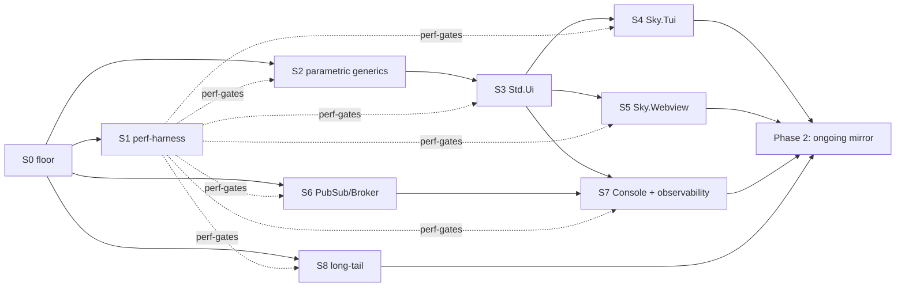

# Rust↔Go backend parity roadmap — design (meta-roadmap / index)

**Date:** 2026-06-09
**Branch:** `feat/runtime-rust` (fork `arthurmaciel/sky` only)
**Status:** approved design, ready for a sequencing/tracking plan

## Purpose

The index document for bringing the Sky **Rust backend to co-equal capability
parity with the Go backend**. It owns the decomposition, the dependency DAG, the
per-slice acceptance model, and the sequencing. It is **not** a code-level
implementation plan — each capability slice gets its own brainstorm → spec →
plan → implementation cycle. The floor-stabilization slice (S0) is already
specced; this roadmap sequences everything after it.

Built on the Part-2 diagnosis (this session): the still-failing `examples/` are
blocked not by 15 scattered features but by **one codegen capability**
(parametric-record generics) plus **two backends that wait on it** (Tui,
Webview), with a handful of independent additive gaps (PubSub, Console,
long-tail).

## What "parity" means here (scope decisions)

- **Co-equal in *capabilities*, not distribution.** Every Go capability gets a
  Rust equivalent. "Co-equal" is feature reach, not being a peer deploy target.
- **Fork-only.** The Rust backend lives **only** in `arthurmaciel/sky`, **never**
  in `anzellai/sky`. Official upstream integration is a future "ask Sky's author"
  event, explicitly out of scope. Upstream-bound PRs must never include
  Rust-backend code.
- **In scope:** the feature-parity spine + a **performance-benchmark** pillar
  (per-slice perf gate) + an **ongoing-parity discipline** (the daily
  upstream-read-only mirror process). Docs in `runtime-rust/CLAUDE.md` +
  `README.md` must stress the co-equal-in-capabilities intent.
- **Out of scope ("until second order"):** SkyDeploy for `--target rust`, WASM
  (`wasm32`), official upstream integration.

## Two phases

- **Phase 1 — reach first parity.** Capability slices S0–S8, dependency-ordered,
  each gated by the acceptance triple.
- **Phase 2 — stay at parity.** The upstream-mirror discipline: ingest
  `anzellai/sky` read-only, mirror each new Go capability into Rust as a
  mini-slice under the same triple, behind a dual-backend CI gate.

## Phase 1 — capability slices

| # | Slice | Unblocks (examples) | Depends on |
|---|---|---|---|
| **S0** | Floor stabilization *(specced — see below)* | restores the working set + builds the sweep + equivalence harness | — |
| **S1** | Perf-harness (Rust-vs-Go: cold-start, throughput, RSS, binary size) | — (gates S2–S8) | S0 |
| **S2** | Parametric-record generics (Rust analogue of Go v0.15 `Cfg_R[T]`) | — (the linchpin capability) | S0 |
| **S3** | Std.Ui renderer on Rust | 19, 24, 25, 26, 37 | S2 |
| **S4** | Sky.Tui backend (ANSI-cell, reuses Std.Ui) | 21, 22, 23 | S3 |
| **S5** | Sky.Webview backend (wry/tao + Bind/Eval, reuses Std.Ui) | 29, 31, 38 | S3 |
| **S6** | PubSub / Broker | 27, 36, 37 | S0 (Live already shipped) |
| **S7** | Sky Console + observability federation | 17, 25, 34 | S3 + S6 |
| **S8** | Long-tail: 06-json pipeline, Std.Cache, Process/Io | 06, 36 | S0 |

S0 spec: `runtime-rust/docs/superpowers/specs/2026-06-09-rust-backend-floor-stabilization-design.md`.

**Composite examples span slices.** The "unblocks" column lists examples a slice
*contributes to*, not necessarily ones it alone makes green. Multi-capability
examples go green only when **all** their required slices land:
`24-tui-kitchen-sink` needs S3 + S4; `25-sky-console` needs S3 + S7;
`31-webview-stopwatch-ui` needs S3 + S4 + S5; `38-composite-ui-multibackend`
needs S3 + S4 + S5. So a slice's example-acceptance is checked on the examples it
*fully* unblocks; composites are validated when their last dependency slice
completes.

### The Go-only reframe (capability, not example)

`11-fyne` (Go GUI) and `02-go-stdlib` (Go-stdlib FFI) are **not** ported as-is.
Under capability-co-equal their capabilities are met by Rust equivalents already
in scope: desktop-GUI via **S5 (Webview)**, Go-stdlib-FFI via the **existing Rust
auto-FFI**. Recorded as "capability-covered, Go-specific example not ported."
They are excluded from the in-scope example count.

### Dependency DAG

Notes: **S6 (PubSub) is dependency-independent of the Std.Ui line** — it only
needs the floor + shipped Live, so strict ordering places it where convenient.
**S1 is built right after the floor** so it can gate every later slice.

## The per-slice acceptance triple (decomposition C)

A Phase-1 capability slice (S2–S8) is "done" only when its examples pass **all
three**:

1. **Example acceptance** — the slice's examples flip to green on the **sweep
   scoreboard** (from S0): `sky build --target rust` + `cargo build` + run.
2. **Equivalence vs the Go backend** — generalizes S0's equivalence harness.
   S0 referenced the *Rust monolith* (refactor stabilization); for new
   capabilities there is no Rust reference, so the reference **shifts to the Go
   backend** (`--target go`), the production reference of record. Same
   differential machinery, **pluggable reference binary**: Rust-monolith for S0,
   Go-backend for S2–S8. Generate with both, run under an input battery,
   byte/semantic-compare (with the volatile-output canonicalizer from S0).
3. **Per-slice perf gate** — the example passes the Rust-vs-Go perf check for its
   app shape, against the envelope S1 establishes.

The **pluggable-reference equivalence harness** (S0) and the **perf harness**
(S1) are built once and reused as the acceptance gate for every later slice.

## The perf harness (S1)

- **Metrics:** cold-start latency, request throughput (Http.Server/Live),
  steady-state RSS, binary size.
- **App-shape coverage:** CLI one-shot, Http.Server under load, Sky.Live SSE
  session — each with a representative example.
- **Tooling:** `hyperfine` (cold-start), a load generator (`oha`/`wrk`) for
  throughput, `/usr/bin/time -v` or cgroup accounting for RSS — driving both the
  `--target go` and `--target rust` built binaries of the same example.
- **Output:** a per-shape Rust-vs-Go table; baselines committed so regressions
  show.
- **Gate thresholds are policy set when S1 lands** (data-driven from the first
  baselines, e.g. "cold-start ≤ Go, RSS ≤ 1.5× Go, throughput ≥ 0.8× Go"), **not
  guessed now**. Each later slice inherits whatever envelope S1 sets.

## Phase 2 — staying at parity (the upstream-mirror discipline)

Activates once S0–S8 are green. A continuous process, not a slice.

1. **Read-only ingest** — `/sync-upstream` pulls the latest `anzellai/sky` into
   `feat/runtime-rust` (ff main, merge, resolve the thin-seam conflicts, adapt
   the Rust backend to shared-type changes). Upstream is read-only source.
2. **Diff the capability delta** — what Go features/fixes/examples landed since
   the last sync.
3. **Mirror each as a mini-slice** — same acceptance triple. The
   `sync-upstream-dce-exposes-rust-bugs` lesson applies: a clean Haskell build ≠
   Rust unaffected — run the full sweep after every sync.
4. **Dual-backend CI gate** — within the fork, every in-scope example stays green
   on **both** backends; the S0 sweep + the pluggable-reference equivalence
   harness *are* that gate. A feature isn't "mirrored" until its Rust example
   passes the triple.

### Fork-only constraint (hard, load-bearing)

- Rust backend only in `arthurmaciel/sky`, never `anzellai/sky`. Upstream-bound
  PRs never include Rust-backend code (reinforces the upstream-PR-autonomy
  guardrail).
- What makes this sustainable is the **shared-seam discipline** (README
  cross-backend rules): new Rust work stays behind `TargetRust ->` branches, the
  Go path stays byte-identical, and Rust code is confined to `runtime-rust/` +
  `src/Sky/Generate/Rust/` + thin seams. The backend is a clean, removable layer
  that never leaks into upstream diffs.

### Docs

- Each capability slice flips its rows in the README "API surface vs Go" table
  from *deferred/missing* → *covered*.
- A doc pass repositions `runtime-rust/CLAUDE.md` + `README.md` from "Rust is
  second-tier" to **"co-equal in capabilities, fork-resident,
  upstream-mirroring"** — stressing the co-equal intent and the never-upstream
  constraint.

## Done-criteria

**First parity (end of Phase 1):**
- The sweep shows every in-scope example green on `--target rust` (in-scope = 41
  minus the Go-only-by-design `02`/`11`).
- Every slice S2–S8 passed its acceptance triple.
- The README "API surface vs Go" table has no *deferred/missing* rows for
  in-scope capabilities.

**Co-equal steady-state (Phase 2 active):**
- The dual-backend CI gate is live and green within the fork.
- The upstream-mirror loop has run **at least once** end-to-end (a real upstream
  release mirrored via the triple).
- `runtime-rust/CLAUDE.md` + `README.md` repositioned to co-equal-in-capabilities
  + fork-only.

## Constraints carried through every slice

- Fork-only: never push the Rust backend to `anzellai/sky`.
- Shared-seam discipline: `TargetRust ->` branches; Go path byte-identical.
- No co-author lines in commits; all docs under `runtime-rust/docs/`.
- CLAUDE.md memory-safety / timeout / disk-hygiene rules.
- Each slice is its own brainstorm → spec → plan → impl cycle; this roadmap is
  the index that tracks status and links each slice's spec.

## Slice status / spec links

| Slice | Status | Spec |
|---|---|---|
| S0 floor | specced | `…/specs/2026-06-09-rust-backend-floor-stabilization-design.md` |
| S1 perf-harness | not started | — (next to brainstorm) |
| S2 parametric generics | not started | — |
| S3 Std.Ui | not started | — |
| S4 Sky.Tui | not started | — |
| S5 Sky.Webview | not started | — |
| S6 PubSub/Broker | not started | — |
| S7 Console | not started | — |
| S8 long-tail | not started | — |
| Phase 2 mirror | not started | — |

## Next concrete action

After this roadmap's sequencing/tracking plan, brainstorm **S1 (perf-harness)** —
it gates every later slice and S0 is already specced.
